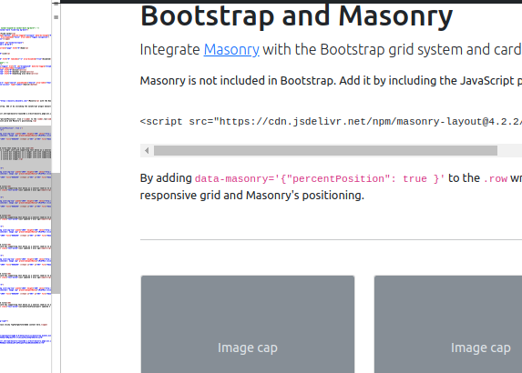

## para correr con flask 
- vvvv=.fenv

de ...
```
pk@pk:~/1kwm2.github.io$ type vvvv
vvvv () 
{ 
    deactivate;
    python3 -m venv ./.fenv;
    source ./.fenv/bin/activate;
    pip install -r requirements.txt;
    python app.py
}
pk@pk:~/1kwm2.github.io$ 

```
## generar y deplegar ej gh con 'elsa'
- ggg=gh-pages

de ...

```
pk@pk:~/1kwm2.github.io$ type ggg
ggg () 
{ 
    function en.app.py () 
    { 
        cat <<EEOOFF
    }
		if __name__ == '__main__':
		    import sys
		    if len(sys.argv) > 1:
		            from elsa import cli
		            cli(app, base_url='https://asolear.es')
		    else:
		        app.run(debug=True, host='0.0.0.0', port=8888)
EEOOFF

    echo python app.py serve
    python app.py freeze;
    python app.py deploy
}
pk@pk:~/1kwm2.github.io$ 

```

## push a gh
gg

```
pk@pk:~/1kwm2.github.io$ type gg
gg () 
{ 
    git checkout master;
    [ ! -f ./.gitignore ] && .gitignore;
    git merge cc;
    git add . && git commit -m "prg $(date)" && git push -u --all;
    git checkout cc;
    git merge master;
    git remote -v
}
pk@pk:~/1kwm2.github.io$ 

```


# Publications


## List of my published technological articles
<br>
<br>


[Python if __name__ == __main__ Explained with Code Examples](https://www.freecodecamp.org/news/if-name-main-python-example/) - 
herramienta de calculo de perdidas por sombras


_freeCodeCamp, Jul 03, 2020._ 

<br>
<br>
<br>
<br>
<br>
<br>
